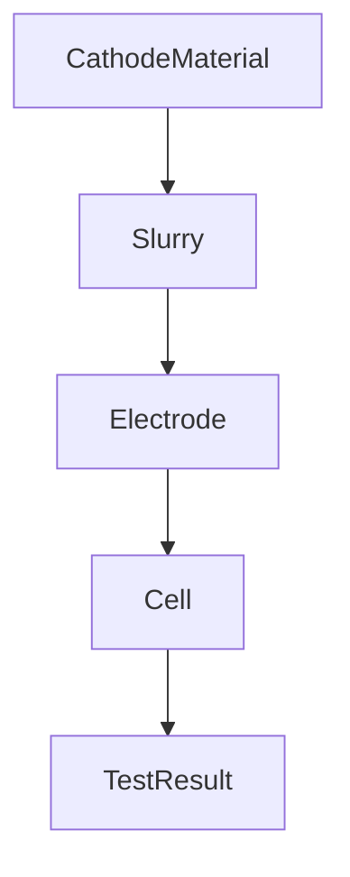

# Architecture and Stage Models

This project models the manufacturing workflow of a battery cathode through a
series of MongoEngine document models. Each stage points to its precursor via a
`parent` field and shares metadata through a simple inheritance helper. The
chain mirrors the physical process and allows downstream data such as
`TestResult` documents to carry context from the original material.



## Metadata inheritance

Every model exposes a `metadata` dictionary. The
[`inherit_metadata`](../Python_Codes/BLeifer_Battery_Analysis/battery_analysis/models/stages.py)
helper walks up the `parent` chain and merges these dictionaries so that child
values override those of their ancestors. Calling `clean()` or using the
`from_parent` helpers ensures the merged metadata is stored before saving.

### Example propagation

| Stage            | Metadata provided                    | Result after inheritance                                       |
|------------------|--------------------------------------|----------------------------------------------------------------|
| CathodeMaterial  | `{"material":"NMC"}`              | `{"material":"NMC"}`                                       |
| Slurry           | `{"solids":45}`                   | `{"material":"NMC","solids":45}`                        |
| Electrode        | `{"loading":5}`                   | `{"material":"NMC","solids":45,"loading":5}`         |
| Cell             | `{"format":"2032"}`              | `{"material":"NMC","solids":45,"loading":5,"format":"2032"}` |
| TestResult       | `{"tester":"Arbin"}`             | `{"material":"NMC","solids":45,"loading":5,"format":"2032","tester":"Arbin"}` |

## Creating entities

Create objects using the provided class methods so references and metadata are
wired correctly:

1. **CathodeMaterial** – starting point for metadata.
   ```python
   from battery_analysis.models import CathodeMaterial
   mat = CathodeMaterial(name="M1", metadata={"material": "NMC"})
   mat.save()
   ```
2. **Slurry** – derived from a material.
   ```python
   from battery_analysis.models import Slurry
   slurry = Slurry.from_parent(mat, solids_content=45)
   slurry.save()
   ```
3. **Electrode** – derived from slurry.
   ```python
   from battery_analysis.models import Electrode
   elec = Electrode.from_parent(slurry, loading=5)
   elec.save()
   ```
4. **Cell** – assembled from electrode.
   ```python
   from battery_analysis.models import Cell
   cell = Cell.from_parent(elec, format="2032")
   cell.save()
   ```
5. **TestResult** – references the cell and inherits all metadata.
   ```python
   from battery_analysis.models import TestResult, inherit_metadata
   test = TestResult(sample=..., parent=cell, tester="Arbin")
   test.metadata = inherit_metadata(test)
   test.save()
   ```

Following this sequence ensures that each entity is created in the correct
order and that all downstream documents receive the accumulated metadata from
previous stages.
